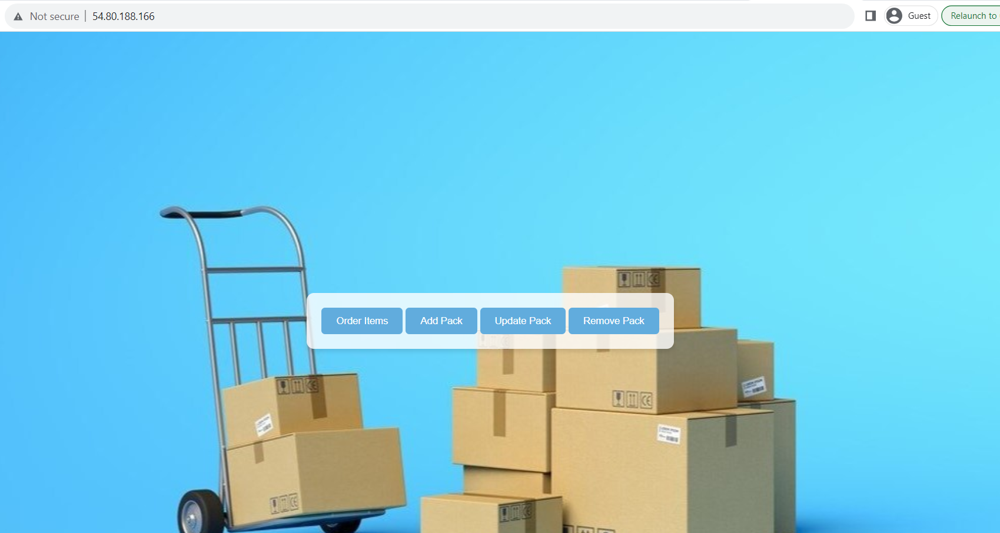

# shipment-handler-go
Pack shipment management in golang

## Usage 
Go to ip "54.80.188.166", the web app will provide you multiple option to order items, add pack, update pack and remove pack. After ordering, the web app will calculate an optimized solution and show how many pack will requi.

## Example Cases
Here are some example cases to illustrate how the application works:
- **Items ordered: 1**
  - Number of packs: 1 x 250

- **Items ordered: 250**
  - Correct number of packs: 1 x 250

- **Items ordered: 251**
  - Correct number of packs: 1 x 500

- **Items ordered: 501**
  - Correct number of packs: 1 x 500, 1 x 250

